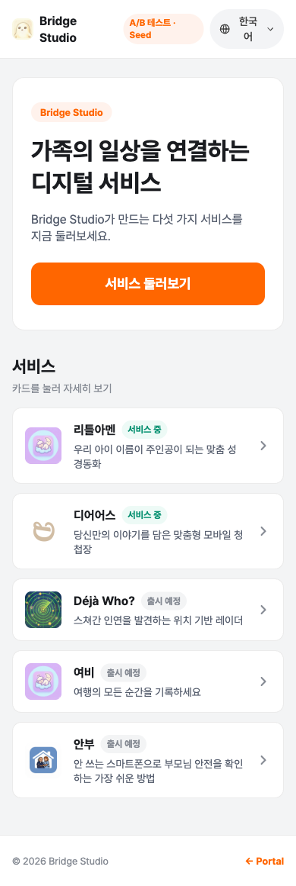

# daangn-seed-ai

> AI-first snapshot of daangn/seed-design, packaged as a Claude Code plugin.

빠른 앱 개발에서 generic AI-slop을 회피하고, 토큰·컴포넌트·결정 매트릭스 기반으로 [Seed Design System](https://github.com/daangn/seed-design) 스타일의 UI를 작성하도록 안내한다.

## 한눈에 보기

<table>
<tr>
<th align="center">원본 — 직접 작성한 랜딩</th>
<th align="center">daangn-seed-ai 적용 후</th>
</tr>
<tr>
<td align="center"></td>
<td align="center"></td>
</tr>
</table>

같은 정보(Bridge Studio 서비스 리스트)를 Seed 토큰·컴포넌트 anatomy로 재구성한 예시. "Claude로 Seed 스타일 만들어줘" 한 번으로 오른쪽 구성(`ActionButton` brandSolid CTA, `List` 패턴, `Badge`로 "서비스 중/출시 예정" 상태)이 나온다. 스킬은 의미론적 토큰·기존 컴포넌트 anatomy·브랜드 컬러 일관성을 강제한다.

## 왜 필요한가

Seed 공식 문서는 사람이 읽기 위해 설계됐다. 마케팅 랜딩, 인터랙티브 playground, 산문형 설명. Claude가 그 구조를 소비하려면 여러 페이지를 왔다 갔다 하며 맥락을 재구성해야 하고, "언제 쓰지 말아야 하나"는 거의 보이지 않는다.

당근이 배포하는 공식 `seed-design` 스킬도 좋지만 `seed-design.io`의 llms.txt를 런타임 WebFetch로 불러오는 구조라 upstream이 사라지면 동작하지 않는다.

이 스킬은 Seed를 Claude의 소비 방식에 맞춰 재구조화한 **self-contained 스냅샷**이다.

- **decision-first** — "어느 컴포넌트를 쓸지"가 제일 어렵다. `decision-matrices/`가 `components/`보다 먼저 참조된다.
- **anti-patterns 일급** — "이렇게 쓰지 마세요"가 AI-slop을 더 잘 막는다. generic AI가 반복하는 실수 13종을 grep 가능한 형태로 나열.
- **structured data > 산문** — slot/variant/state/token을 테이블로. Claude는 테이블을 더 정확히 소비한다.
- **self-contained** — 모든 토큰·anatomy가 파일로 들어있다. seed-design.io가 private 돼도 동작.
- **한국어 UX 내장** — `maxGraphemeCount`, Seed의 한국어 line-height 등 한국어 기준 세팅 반영.

## 설치

Claude Code 플러그인으로 배포된다. `/plugin` 명령을 지원하는 버전이 필요하다.

### 1) 마켓플레이스 등록 + 플러그인 설치 (권장)

Claude Code에서:

```
/plugin marketplace add byunghun-ben/daangn-seed-ai
/plugin install daangn-seed-ai@daangn-seed-ai
```

설치 후 `/reload-plugins` 또는 Claude Code 재시작. 스킬은 네임스페이스가 붙은 `/daangn-seed-ai:seed` 이름으로 나타나며, description 기반 자동 로드도 동작한다.

### 2) 로컬 체크아웃으로 테스트

개발·개조용. 레포를 클론한 뒤 `--plugin-dir`로 바로 붙인다.

```bash
git clone https://github.com/byunghun-ben/daangn-seed-ai.git
claude --plugin-dir ./daangn-seed-ai/plugins/daangn-seed-ai
```

동일한 이름의 마켓플레이스 플러그인이 설치돼 있어도 로컬 복사본이 그 세션에서 우선한다.

## 사용

스킬은 아래 같은 트리거로 자동 로드된다.

- "당근 스타일로 회원가입 페이지 만들어줘"
- "Seed 기반으로 중고거래 리스트 UI"
- "AI 스럽지 않은 UI가 필요해"

또는 명시적으로 `/daangn-seed-ai:seed` 호출.

스킬이 로드되면 `SKILL.md`의 "작업 유형별 라우팅" 표에 따라 skill 디렉토리의 `references/` 하위 파일을 선택적으로 읽는다.

## 레포 구조

```
daangn-seed-ai/                              # 레포 루트 = 마켓플레이스
├── .claude-plugin/
│   └── marketplace.json                     # 마켓플레이스 카탈로그
├── plugins/
│   └── daangn-seed-ai/                      # 플러그인 루트
│       ├── .claude-plugin/
│       │   └── plugin.json                  # 플러그인 매니페스트
│       └── skills/
│           └── seed/                       # 스킬 루트 (→ /daangn-seed-ai:seed)
│               ├── SKILL.md                 # 진입점
│               └── references/
│                   ├── index.md             # 트리 + 읽는 순서
│                   ├── _snapshot.json       # upstream commit SHA + 스냅샷 메타
│                   ├── philosophy.md        # AI-slop 회피 원칙
│                   ├── anti-patterns.md     # 금지 사항 13종 (검증 체크리스트)
│                   ├── tokens/              # 원본 JSON 10개 + intent 맵 md
│                   ├── components/          # MVP 6개 + _template
│                   ├── layout/primitives.md # Stack/Flex/Grid/Box 선택 가이드
│                   └── decision-matrices/   # which-button / -overlay / -input / composition
├── scripts/                                 # 개발용 하네스 (배포 제외)
├── NOTICE.md                                # Apache 2.0 attribution
├── LICENSE
└── README.md
```

## 개발용 스크립트

`scripts/`는 플러그인 패키지에 포함되지 않는다. 레포를 클론해서 레포 루트에서 실행.

### `scripts/sync-from-seed.mjs` — upstream diff 리포트

```bash
node scripts/sync-from-seed.mjs
```

업스트림 Seed를 `/tmp/seed-design-sync`에 얕게 클론해서 토큰·컴포넌트 diff를 출력한다. **자동 반영은 하지 않는다** — human-first → AI-first 번역에는 판단이 들어가서 자동화하면 품질이 떨어진다. 사람이 diff를 보고 `plugins/daangn-seed-ai/skills/seed/references/`와 `_snapshot.json`을 수동 갱신한다.

### `scripts/test.mjs` — 드라이런 하네스

```bash
node scripts/test.mjs                        # 모든 시나리오
node scripts/test.mjs signup                 # 하나만
node scripts/test.mjs --lint-only <path>     # 파일 린트만
```

시나리오별로 fresh `claude -p` 서브프로세스를 띄워 스킬을 실제로 소비하게 하고, 생성된 HTML을 anti-patterns 기준으로 grep-린트한다. 결과물은 `temp/daangn-runs/<timestamp>/`에 저장 (gitignore됨).

내장 시나리오:
- `signup` — 폼 중심 (TextField × 3, Callout, 2-button footer)
- `listDialog` — 파괴적 Dialog (criticalSolid, 주 액션 우측)
- `feedback` — Snackbar vs Dialog 구분

## 커버리지 (MVP)

**포팅됨 (6 components)**: ActionButton, Callout, Snackbar, Dialog, BottomSheet, TextField + 토큰 전체 + 레이아웃 + 결정 매트릭스 4개.

**미포팅** (필요 시 `components/_template.md`로 추가):
Avatar, Badge, Chip, Checkbox, RadioGroup, Switch, SegmentedControl, Tabs, List, Icon, Skeleton, Slider, SelectBox, FieldButton, Fab 등. `scripts/sync-from-seed.mjs`가 미포팅 항목을 `not-ported`로 리포트한다.

## Attribution

Seed 스냅샷 데이터와 컴포넌트 구조는 [daangn/seed-design](https://github.com/daangn/seed-design) (Apache 2.0)에서 파생. 상세는 [NOTICE.md](./NOTICE.md).

스냅샷 버전은 [`plugins/daangn-seed-ai/skills/seed/references/_snapshot.json`](./plugins/daangn-seed-ai/skills/seed/references/_snapshot.json) 참조.

## 라이선스

Apache License 2.0. [LICENSE](./LICENSE) 참조.
